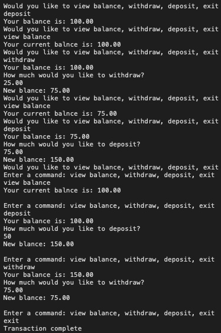
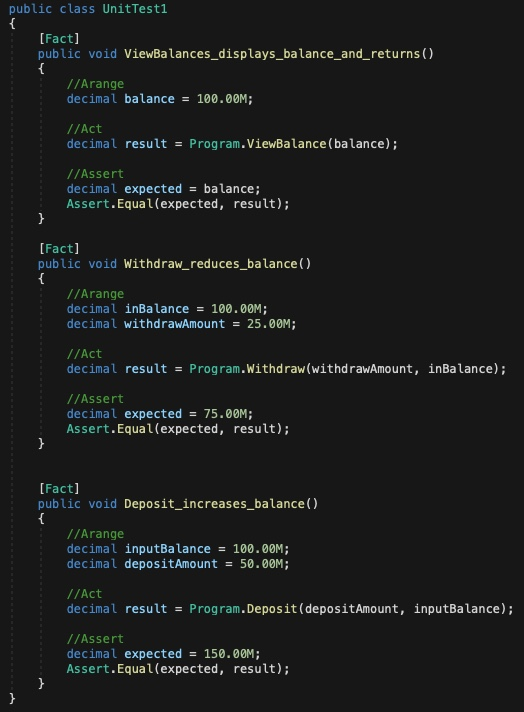

# Lab02-Unit_Testing

## ATM

Lab02-Unit_Testing

*Author: Enrique Hilst*

----

## Description
***[Tell me about your application, should be about a paragraph]***
This is a C# console application that will ask a user to enter a command from a list.
---

### Getting Started
Clone this repository to your local machine.

```
$ git clone https://github.com/ehilst515/Lab02-Unit_Testing.git
```

### To run the program from Visual Studio:
Select ```File``` -> ```Open``` -> ```Project/Solution```

Next navigate to the location you cloned the Repository.

Double click on the ```Lab02-Unit_Testing``` directory.

Then select and open ```Lab02.sln```

---

### Visuals


